**MSX Dual Disk Drive Controller**

**HB720**

***Based on Memory Mapped Registers***

**Compatible with:**

**EPCOM/SHARP HB-3600**


**SONY HBD-50**


***Based on MSXHans, 2001 PDF***

***By Evandro Souza 2024, January.***

**TABLE**

**OF CONTENTS**

**1. OPERATION**

1-1. FEATURES 1-1

[1-2. SPECIFICATIONS 1-1](#bookmark8)

[1-3. PARTS IDENTIFICATION 1-1](#bookmark4)

1.  

[-3-1. Drive Unit 1-1](#bookmark6)1-3-2. Interface Cartridge 1-1

1-4. CONNECTING THE UNIT 1-2

[1-5. INSERTING A DISK 1-2](#bookmark12)

[1-6. STARTING UP MSX-DISK BASIC 1-2](#bookmark10)

[1-7. FORMATTING A BLANK DISK 1-3](#bookmark14)

[1-8. PIN ASSIGNMENT OF THE CONNECTORS ..1-3](#bookmark16)

**2. THEORY OF OPERATION**

2-1. HB720 CARTRIDGE

2-1-1. Memory Map ...

2-1-2. Selection by Cartridge ...

2-1-3. Selection by FDC Controller .

2-2. FDC

2-2-1. Memory Map Detailed

2-2-2. Selection of Individual FDC Registers

2-2-3. Operation of Individual Registers 

2-1
2-2

**3. BLOCK DIAGRAM**

OVERALL......................3-1

**4. SCHEMATIC DIAGRAM AND PRINTED CIRCUIT BOARD**

HB720 BOARDS ............ 4-1

CARTRIDGE BOARD
PCB............................................\.........\...4-1

CARTRIDGE BOARD Schematics................
..........................\... 4-2

FDC BOARD
PCB..................................................................
4-3

FDC BOARD SCHEMATICS....................................................
4-4


**5. SCHEMATIC DIAGRAM AND PRINTED CIRCUIT BOARD**..
\...\...\...\...\...\...\....
\...\...\...\...\...\...\...\...\...\...\.... 5-1


1.  **OPERATION**

> 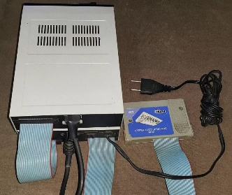{width="1.5072856517935258in"
> height="1.1582185039370079in"}[]{#bookmark4 .anchor} **1-3. PARTS
> IDENTIFICATION**

The HBD-50 floppydisk drive unit allows 3 1/2-inch micro floppydisks to
be used with an MSX standard computer.

The 3 1/2-inch micro floppydisk is packaged in a hard case provided with
a metal disk guard. 360K bytes of data can be recorded on a single disk
and the contents can be easily retrieved and rewritten. This floppydisk
drive unit will greatly extend the information-handling capabilities of
your MSX computer.

[]{#bookmark6 .anchor}

**1-3-1. Drive Unit**

[]{#bookmark8 .anchor}**1-2. SPECIFICATIONS**

**Interface Section**

Interface specifications

Internal ROM

Power consumption

Fits to MSX slots

16K bytes

Standard I/O routines

Standard DOS routines

MSX-Disk BASIC Utility routines

\+ 5 V, 300 mA or less

**Drive Section**

Disk used

Disk type

Recording capacity

5¼" and 3^1^/~2~\" floppy disk

Single and Double-sided

Formatted : 360K / 720K bytes

Bytes/sector: 512

Sectors/track : 9

Tracks/cylinder: 2

Tracks/disk: 80

Bytes/disk : 360K / 720K

40 / 80 cylinders

40 / 80 / 160 tracks

MFM (Modified-Frequency Modulation)

300 rpm

250 K bits/sec

100 msec

Average : 350 msec

Between tracks : 12 msec

Settling time : 30 msec

WD2793-02

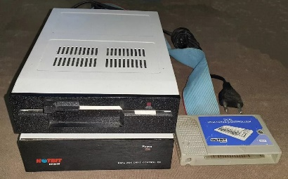{width="1.864377734033246in"
height="1.1595089676290464in"}

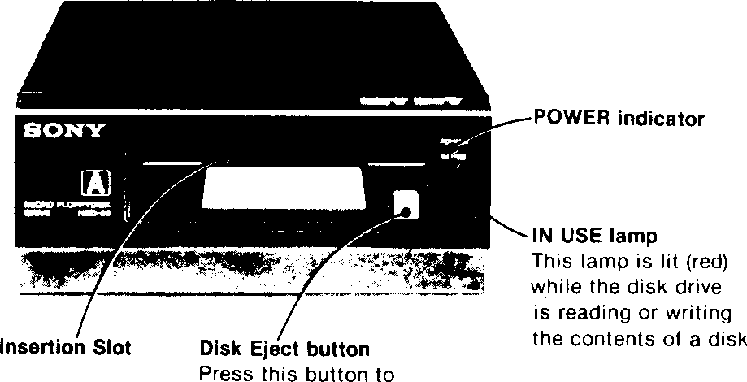{width="2.35625in"
height="1.2048611111111112in"}

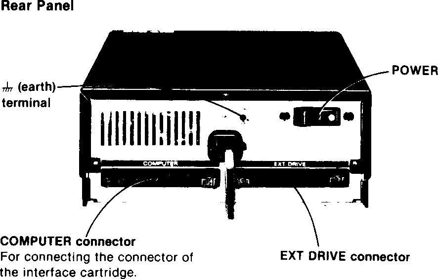{width="2.2715277777777776in"
height="1.448611111111111in"}

Total no. of cylinders Total no. of tracks Recording method Disk
rotation speed Data transfer rate Average latency time Access time

Controller

United kingdom model 240V ac, 50Hz

European model 220 V ac, 50 Hz

Brazilian model 127/220V ac (switch selected) 60 Hz

United Kingdom model 25W

European model 24 W

{width="1.2458672353455817in"
height="1.2826443569553805in"}Brazilian model 16W

10^o^C-35°C (50^o^F-95°F) 160 x 67 x 260 mm (w/h/d)

For the drive unit only, including the projecting parts

Interface cartridge : 240 g

Drive unit: 2.7 kg (excludes the disk)

Blank disk (1)

Disk labels (3)

> []{#bookmark10 .anchor}**1-6. STARTING UP MSX-DISK BASIC**

**Notes on connection**

**eSet** the POWER switch of the device to be connected to OFF.
Connec­ting the device while its power is ON may damage the internal
circuitry. eWhen disconnecting the connector or cartridge, be sure to
take hold of the plug or the cartridge. Pulling on the cord may break
the wires.

•As a safety precaution, do not connect the power cord until all other
connections have been completed.

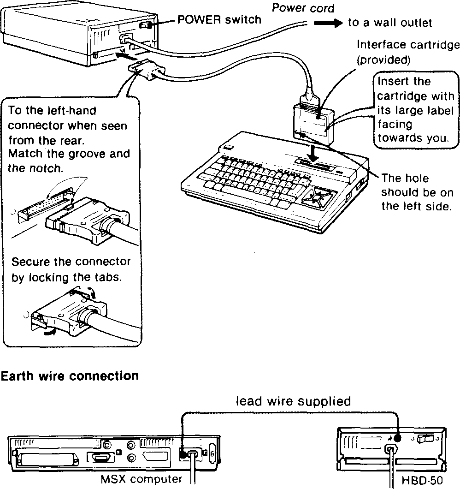{width="2.5993055555555555in"
height="2.7604166666666665in"}

MSX-Disk BASIC is stored in ROM (read-only memory) within the inter­face
cartridge of HBD-50.

When the interface cartridge is inserted into the cartridge slot of the
com­puter, Disk BASIC is started up by simply switching on the power of
the disk drive unit and the computer.

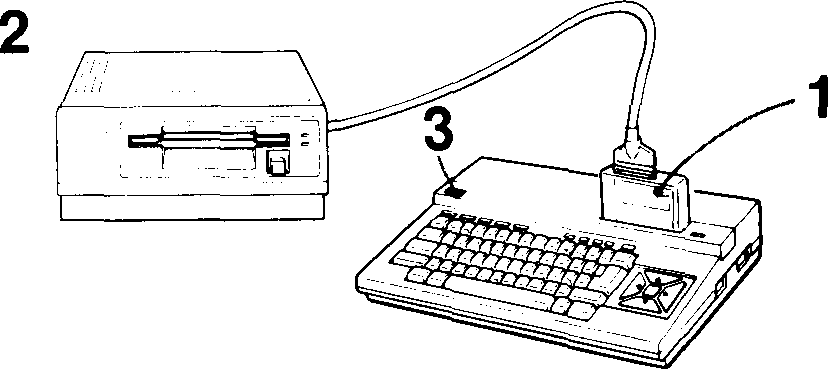{width="2.15625in"
height="0.9611111111111111in"}

1.  Insert the interface cartridge.

2.  Set the POWER switch of HBD-50 to ON.

3.  Set the POWER switch of the computer to ON.

> When Disk-BASIC begins operating, the following message is displayed
> on the screen :

4.  Enter the year, month, and date using two digits per entry (and
    con­necting each entry by a hyphen) or simply press the
    [[\[Return]{.smallcaps}\|]{.underline} key^1^). When the
    [[\[return]{.underline}\]]{.smallcaps} key is pressed, the screen
    will display the follow­ing message which indicates the Disk-BASIC
    has "signed on".

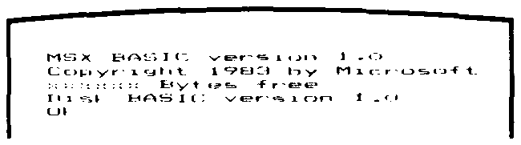{width="1.6930555555555555in"
height="0.47152777777777777in"}

**Precautions**

Be sure to switch on the power of the drive unit before that of the
com­puter. If the computer has been turned on first, either press the
RESET button of the computer or set the POWER switch of the computer to
OFF, then to ON.

[]{#bookmark12 .anchor}**1-5. INSERTING A DISK**

Without opening the metal disk guard, insert the floppy­disk and gently
push it *in until you hear* a click.

1\) With MSX Disk-BASIC, date data set in this situation is not used.

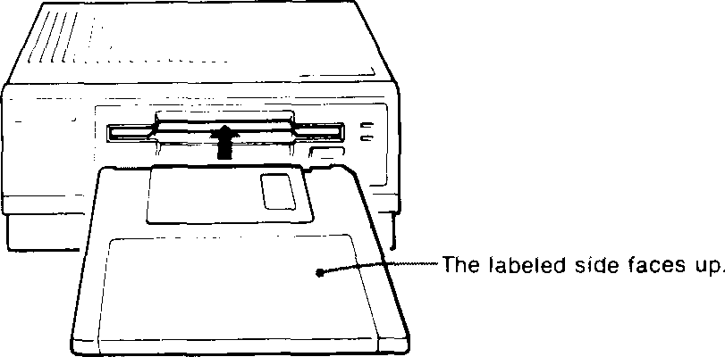{width="2.1118055555555557in"
height="1.0416666666666667in"}

**Removing the disk**

Press this button.

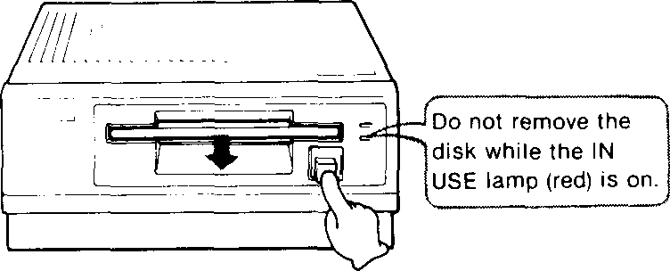{width="1.9583333333333333in"
height="0.7916666666666666in"}

> []{#bookmark16 .anchor}**1-7. PIN ASSIGNMENT OF THE CONNECTORS**
>
> **Pin Assignment of the Connectors**
>
> HB720 CARTRIDGE TO FDC: IDC 34 pins connector (BOTH SIDES)
>

  ---------------------------------------------------------------------------------
  Pin   Signal       Pin   Signal         Pin   Signal       Pin No. Signal
  No.                No.                  No.                        
  ----- ------------ ----- -------------- ----- ------------ ------- --------------
  1     GNDD         10    FDC_RE         19    GNDD         28      FDC_D5
        (RETURN)                                (RETURN)             

  2     DRQ          11    GNDD (RETURN)  20    FDC_D1       29      GNDD (RETURN)

  3     N.C.         12    FDC_A0         21    GNDD         30      FDC_D6
                                                (RETURN)             

  4     IRQ          13    GNDD (RETURN)  22    FDC_D2       31      GNDD (RETURN)

  5     GNDD         14    FDC_A1         23    GNDD         32      FDC_D7
        (RETURN)                                (RETURN)             

  6     FDC_WE       15    GNDD (RETURN)  24    FDC_D3       33      GNDD (RETURN)

  7     N.C.         16    FDC_A2         25    GNDD         34      RESET
                                                (RETURN)             

  8     FDC_CS       17    GNDD (RETURN)  26    FDC_D4       None    NONE

  9     GNDD         18    FDC_D0         27    GNDD          None   NONE
        (RETURN)                                (RETURN)             
  ---------------------------------------------------------------------------------

> HB720 FDC TO EXT FLOPPPY DRIVE -- Edge card connector (34 pins)

-   The pinout are the same for 5 ¼" and 3 ½" drives and the cable may
    have both options:

    -   To use with 5 ¼", the connector is a card edge;

    -   To use with 3 ½" the connector is a 34 pin female IDC.
```
  ---------------------------------------------------------------------------------
  Pin   Signal         Pin   Signal       Pin   Signal      Pin    Signal
  No.                  No.                No.               No.    
  ----- -------------- ----- ------------ ----- ----------- ------ ----------------
  1     DISK CHANGE    10    DRIVE SELECT 19    GNDD        28     WRITE PROTECT
        RESET                0                  (RETURN)           

  2     DISK CHANGE    11    GNDD         20    STEP        29     GNDD (RETURN)
                             (RETURN)                              

  3     GNDD (RETURN)  12    DRIVE SELECT 21    GNDD        30     READ DATA
                             1                  (RETURN)           

  4     IN USE         13    GNDD         22    WRITE DATA  31     GNDD (RETURN)
                             (RETURN)                              

  5     GNDD (RETURN)  14    DRIVE SELECT 23    GNDD        32     (HEAD SELECT)
                             2                  (RETURN)           

  6     DRIVE SELECT 3 15    GNDD         24    WRITE GATE  33     GNDD (RETURN)
                             (RETURN)                              

  7     GNDD (RETURN)  16    MOTOR ON     25    GNDD        34     READY
                                                (RETURN)           

  8     INDEX          17    GNDD         26    TRACK 00    None   NONE
                             (RETURN)                              

  9     GNDD (RETURN)  18    DIRECTION    27    GNDD        None   NONE
                                                (RETURN)           
  ---------------------------------------------------------------------------------
```

## **THEORY OF OPERATION** {#theory-of-operation .list-paragraph}

**2-1. Cartridge Board**

**2-1-1. Memory Map**

This board cartridge uses the MSX computer cartridge slot. Addresses
4000H through 7FFFH on the memory map have been allocated to the HB720
cartridge.

{width="2.6645833333333333in"
height="1.398611111111111in"}

**2-1-2. Selection by HB720 Cartridge**

> When the HB720 cartridge has been inserted into the MSX computer
> cartridge slot, addresses 4000H through 7FFFH will be selected by the
> cartridge connector signal CS1. In addition, U1 will AND signal SLTSL
> and the ICS (address decoder) output that has been inverted by U1, and
> will provide an output to U5 (ROM) pin CE for selection of the ROM.

**2-1-3. Selection by FDC Controller**

Individual registers of the FDC board have been allocated to the memory
space for addresses 7FF8H through 7FFFH, and are selected by address
signals A0 through A2 and signal FDC_CS.

{width="2.5443011811023624in"
height="3.283915135608049in"}

**2-2. FDC Board**

**2-2-1. Memory Map Detailed**

**2-2-2. Selection of Individual FDC chip Registers**

Individual registers of the FDC (U4) have been allocated to addresses
7FF8H through 7FFBH, and are selected by address signals AO through A2
and signal CS.

> {width="3.3619641294838147in"
> height="1.0724639107611549in"}
>
> CR (COMMAND REGISTER
>
> DR (DATA REGISTER
>
> DSR (DATA SHIFT REGISTER
>
> SCR (SECTOR REGISTER
>
> TR (TRACK REGISTER
>
> STR (STATUS REGISTER

{width="1.968837489063867in"
height="1.101091426071741in"}

> Hl-Z (HIGH IMPEDANCE)

**2-2-3. Operation of Individual Registers**

-   IRQ/DRQ Status - 7FFFH

{width="2.4838626421697287in"
height="0.4348600174978128in"}

> IRQ will be made \"0\" when the completion of a command has been
> either concluded or terminated during process.
>
> DRQ will be made \"0\" when the data write/read are being requested.

-   Drive Select - 7FFDH

> {width="3.45625in"
> height="2.1951388888888888in"}

-   Side Select - 7FFCH

DATA BIT

> {width="2.7291852580927385in"
> height="0.39641732283464565in"}

At \"0\", side 0 will be selected, and at \"1\", side 1 will be selected

-   Command Register (CR) - 7FF8H

This is an 8-bit write register, where the commands that correspond to
the WD2793-02 operation will be written from the processor.

With the exception of a forced interrupt command, the command writing
operation takes place after completion of the previous WD2793-02
command.

-   Status Register (STR) - 7FF8H

This is an 8-bit read register. This register indicates the WD2793-02
internal status, the command execution processed status, and the disk
drive status. The significance of individual bits will vary depending on
whether the command is being executed or the command execution has
already been concluded.

-   Data Register (DR) - 7FFBH

This is a read/write register. In a disk reading mode, the data read of
the disk will be loaded into this register. In a disk writing mode, the
data that has been written earlier into this register will be written
into the disk. In a seek mode, the target track address will be written
this register.

-   Track Register (TR) - 7FF9H

This is an 8-bit read/write register. The low-high transition of MR
(master reset) will set TR at FFH. When TROO becomes low, TR will be
made OOH.

The track number at which the head is located will usually be set in
this register. At WD2793-02, this value may either be updated or not,
depending on the command. In the case of a read data command or a write
data command, the contents of this register will be compared with an ID
field track number read of the disk, and when they coincide with each
other, the read or write operation will duly be carried out.

-   Sector Register (SCR) - 7FFAH

This is an 8-bit read/write register. In the case of a read data command
or a write data command, the contents of this register will be compared
with an ID field track number read of the disk, and when they coincide
with each other, the read or write operation will duly be carried out.

When under a read address command, the ID field track number will be
retained intact.

{width="11.136805555555556in"
height="6.745833333333334in"}

{width="10.502777777777778in"
height="5.811594488188977in"}

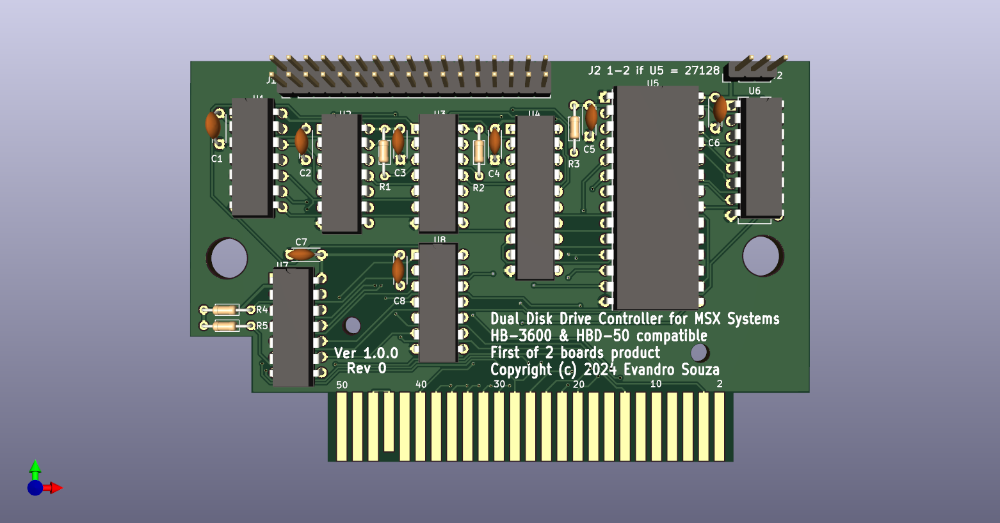{width="5.659027777777778in"
height="2.963888888888889in"}

## **HB720 Boards**

**SCHEMATIC DIAGRAM AND PRINTED CIRCUIT BOARD**

**CARTRIDGE BOARD - COMPONENT SIDE**

{width="2.4713385826771654in"
height="1.6156911636045495in"}

{width="2.4966786964129484in"
height="1.617321741032371in"}

{width="2.380028433945757in"
height="1.6680555555555556in"}

{width="2.4713188976377953in"
height="1.6173556430446194in"}

{width="2.476933508311461in"
height="1.6242038495188102in"}

## CARTRIDGE BOARD -- SCHEMATICS

{width="10.133090551181102in"
height="7.170369641294839in"}

FDC Board PCB & Schematics

{width="3.570551181102362in"
height="1.8697845581802275in"}

{width="2.7089107611548555in"
height="1.630051399825022in"}

{width="2.710518372703412in"
height="1.5143438320209974in"}

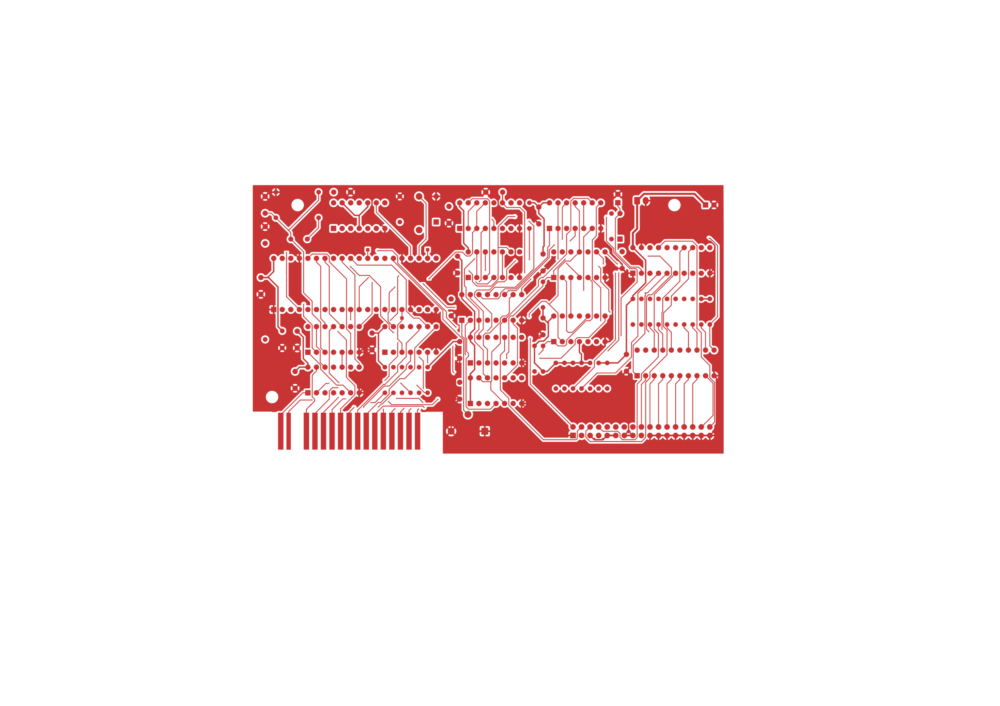{width="7.0055555555555555in"
height="4.9534722222222225in"}

{width="2.673632983377078in"
height="1.5597779965004375in"}

{width="2.628765310586177in"
height="1.5460115923009623in"}

{width="11.100971128608924in"
height="7.855201224846894in"}

## **SEMICONDUCTOR** **PIN ASSIGNME*N*TS**

MB74LS04 (FUJITSU)

SN74LS04N \^Tl) TTL INVERTER --- TOP VIEW ---

MB74LS14 (FUJITSU)

SN74LS14N (Tl)

TTL SCHMITT TRIGGER INVERTER --- TOP VIEW ---

M532O6P (MITSUBISHI)

SN74O6N (Tl)

TTL INVERTER BUFFER/DRIVER WITH OPEN-COLLECTOR --- TOP VIEW ---

SN74O7N (Tl)

TTL BUFFER/DRIVER WITH OPEN-COLLECTOR --- TOP VIEW ---

SN74LS10N (Tl)

TTL 3-INPUT POSITIVE NAND GATE --- TOP VIEW ---

0; LOW LEVEL\
***UHIGH*** LEVEL

Y = A

**H**O;LOW LEVEL

1 ; HIGH LEVEL

\*;OPEN COLLECTOR

Y = A

0 LOW LEVEL

1 ; HIGH LEVEL

\* ; OPEN COLLECTOR

MB74LS32 (FUJITSU)

SN74LS32N (Tl)

TTL 2-INPUT POSITIVE-OR GATE --- TOP VIEW ---

MB74LS38 (FUJITSU)

SN7438N (Tl)

SN74LS38N (Tl)

TTL 2-INPUT POSITIVE-NAND GATE BUFFER WITH OPEN-COLLECTOR --- TOP VIEW
---

MB74LS74A (FUJITSU)

SN74LS74AN (Tl)

TTL D-TYPE FLIP FLOP WITH DIRECT SET/RESET --- TOP VIEW ---

\[w\] F?\] \[7;\] H \[ipl M lei

»V IN

SN7414N 0.9 1.7 V

SN74LS14N\--0.8 1.6V

Y=AB=A+B

[A]{.underline} \_B Y.

0; LOW LEVEL

\_L£ ± 1 ; HIGH LEVEL

[^1^ H l°l]{.underline} \* ; OPEN COLLECTOR

  --------- -------- -------- -------- ------------------ -----------------
  INPUTS                               OUTPUTS            

  SD        RolCK             D        Qn+1               Qn+1

  0         1        x        x        1                  0

  1         0        X        X        0                  1

  0         0        X        X        1 \*               1 \*

  1         1                 1        1                  0

  1         1        J^-^     0        0                  

  1         1        0        X        On                 On
  --------- -------- -------- -------- ------------------ -----------------

0;L0W LEVEL 1 ; HIGH LEVEL X; DON'T CARE 1\*; NONSTABLE

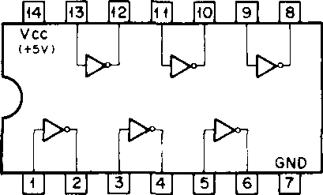{width="1.148611111111111in"
height="0.69375in"}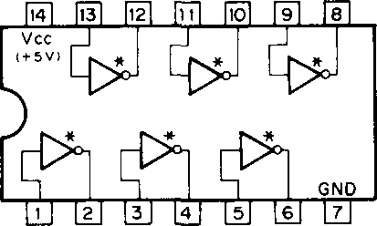{width="1.1604166666666667in"
height="0.6965277777777777in"}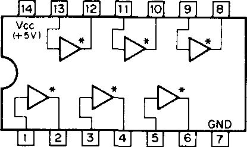{width="1.1659722222222222in"
height="0.69375in"}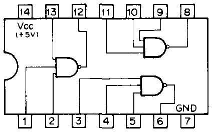{width="1.1881944444444446in"
height="0.7416666666666667in"}{width="0.2777777777777778in"
height="0.13472222222222222in"}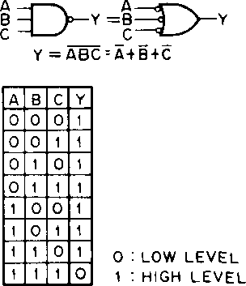{width="0.8541666666666666in"
height="0.9916666666666667in"}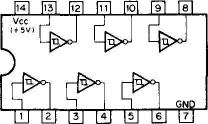{width="1.16875in"
height="0.6965277777777777in"}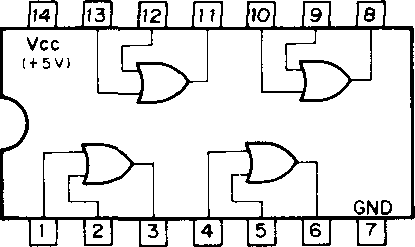{width="1.1659722222222222in"
height="0.69375in"}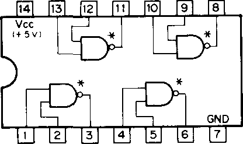{width="1.16875in"
height="0.69375in"}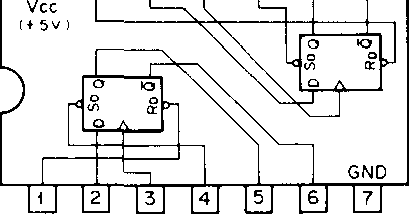{width="1.148611111111111in"
height="0.6013888888888889in"}{width="0.6715277777777777in"
height="0.12083333333333333in"}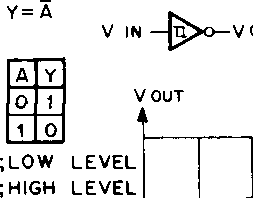{width="0.7104166666666667in"
height="0.55625in"}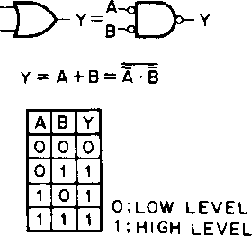{width="0.7868055555555555in"
height="0.7361111111111112in"}

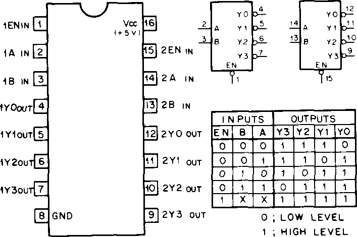{width="1.7854166666666667in"
height="1.1868055555555554in"}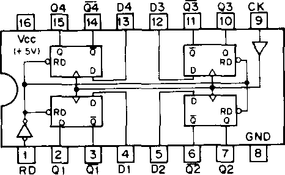{width="1.1770833333333333in"
height="0.725in"}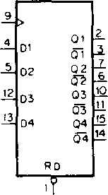{width="0.3861111111111111in"
height="0.6972222222222222in"}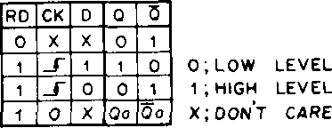{width="0.9416666666666667in"
height="0.3638888888888889in"}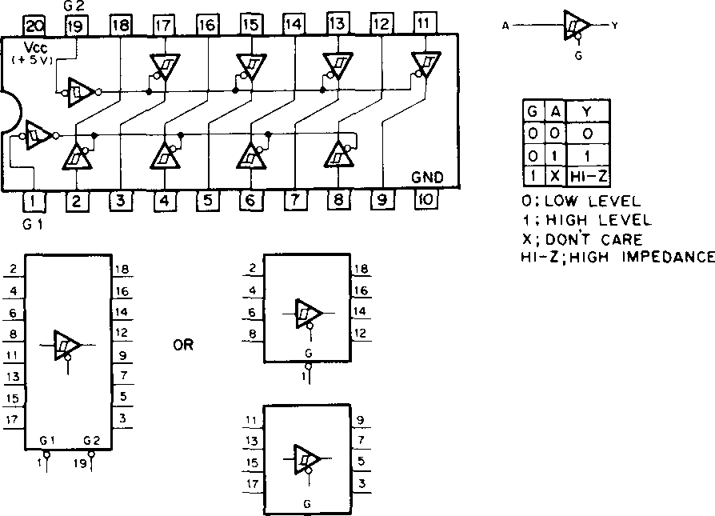{width="2.2576388888888888in"
height="1.6284722222222223in"}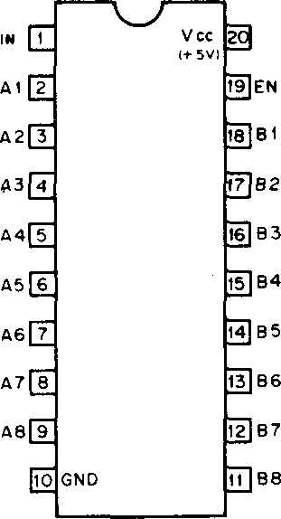{width="0.7854166666666667in"
height="1.4493055555555556in"}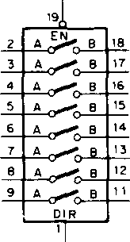{width="0.41388888888888886in"
height="0.7701388888888889in"}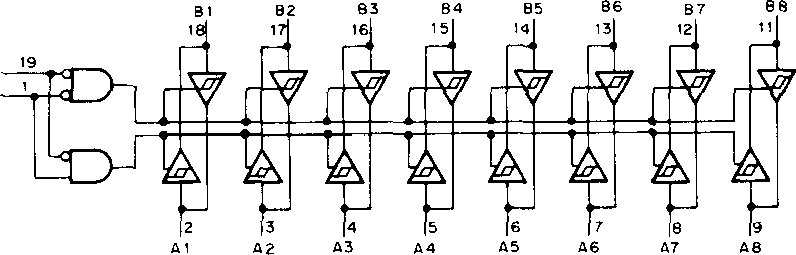{width="2.0104166666666665in"
height="0.64375in"}

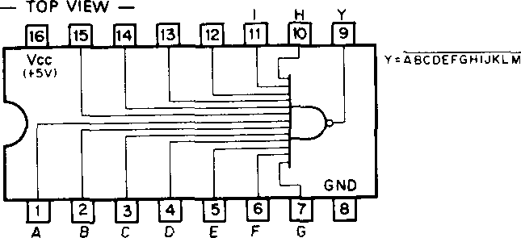{width="1.6284722222222223in"
height="0.7451388888888889in"}SN74ALS133N (Tl)

MB74LS139 (FUJITSU)

SN74LS139N (Tl)

TTL 2-T0-4-LINE DECOOER/DEMULTIPLEXER --- TOP VIEW ---

MB74LS1 75 (FUJITSU)

SN74LS175N (Tl)

TTL O-TYPE FLIP-FLOP WITH CLEAR --- TOP VIEW ---

MB74LS244 (FUJITSU)

SN74LS244N (Tl)

TTL 3-STATE SCHMITT TRIGGER BUFFER/DRIVER --- TOP VIEW ---

HN48271 28G-25 (HITACHI) (ACCESS TIME = 250nS) HN4827128G-30 (HITACHI)
(ACCESS TIME = 300nS) HN4827128G-45 (HITACHI) (ACCESS TIME = 450nS)
N-MOS ERASABLE AND PROGRAMMABLE ROM 128K-BIT \<16384x8) --- TOP VIEW ---

WD2793-02 (WESTERN DIGITAL)

N CHANNEL E/D MOS FLOPPY DISK FORMATTER/CONTROLLER --- TOP VIEW ---

  --------- -------- --------------------------------- -------- -----------
            E        VPP VOD                                    

  Al 2      E                                                   PGM

  A7        U                                                   A13

  A6        \[5                                                 A 8

  AS                                                            A 9

  A4                                                            Al 1

  A3        E                                                   OE

  A2                                                   21\]     A10

  Al        \[I                                        g        CE

  AO        Eo                                         g        D7

  DO        Ei                                                  06

  DI        13                                         13       D5

  D2        E                                          13       D4

            E        GNO                               \<3      03
  --------- -------- --------------------------------- -------- -----------

o [;low level]{.smallcaps}

1 [;high level]{.smallcaps} x [;don't care]{.smallcaps}

  --------- ----- ----------------------------- ------ --------------------
  ENP       £     \'o\'                                HLT

  WE        E                                          IRQ

  CS        E                                   38\|   DRQ

  RE        E                                   53     ODEN

  AO        E                                   E\)    WP RT

  Al        E                                   35\|   [7p]{.smallcaps}

  DALO      □                                          TROO

  DALI      E                                          WPW

  0AL2      E                                   3      READY

  DAL3      E                                   53     WD

  DAL4      E                                          WG

  DALS      E                                   29\]   TG43

  DAL6      E                                   28\]   HLD

  DAL7      E                                          RAW READ

  STEP      Ei                                  g      VCO

  DIRC      E                                   g      ENMF

  5/8       E                                   24\]   CLK

  RPW       E                                   g      PUMP

  MR        E                                   22\]   TEST

            E     GND Vcc                       23     
  --------- ----- ----------------------------- ------ --------------------

CS ***;CHIP*** SELECT

DALO-7 JDATA ACCESS LINES DDEN iDOUBLE DENSITY

DIRC '.DIRECTION

DRO ;DATA REQUEST

ENMF iENABLE MINI-FLOPPY

ENP J ENABLE PRECOMP

HLD » HEAD LOAD

HLT i HEAD LOAD TIMING

IP ;INDEX PULSE

IRQ \'.\'INTERRUPT REQUEST

MR i MASTER RESET

RE । READ ENABLE

***RPW ! READ PULSE*** WIDTH

TG43 I TRACK GREATER THAN43

TROO : TRACK 00

VCO : VOLTAGE-CONTROLLED OSC

WD t WRITE DATA

WE i WRITE ENABLE

WG 'WRITE GATE

WPRT 1 WRITE PROTECT

WPW t WRITE PRECOMP WIDTH

AO-13 ; ADDRESS INPUT CE ; CHIP ENABLE DO-7 ; DATA

OE I OUTPUT ENABLE PGM ; PROGRAM

CR COMMAND REGISTER

DR [;data]{.smallcaps} REGISTER DSR iOATA SHIFT REGISTER SCR SECTOR
REGISTER TR \'.TRACK REGISTER STR \'.STATUS REGISTER

  --------- -------- -------- --------------------- ----------------------
  CS        A 1      AO       RE = 0                WE = 0

  1         X        X        NON SELECT            OAL = HI-Z

  0         0        0        STR                   C R

  0         0        1        TR                    TR

  0         1        0        SCR                   SCR

  0         1        1        DR                    OR
  --------- -------- -------- --------------------- ----------------------

REGISTER SELECTION

0 ;LOW LEVEL

1 I HIGH LEVEL X ; DON'T CARE Hl-Z; HIGH IMPEDANCE

**HB720**

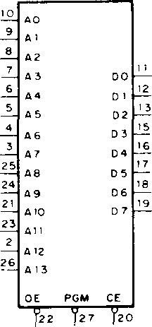{width="0.5701388888888889in"
height="1.2215277777777778in"}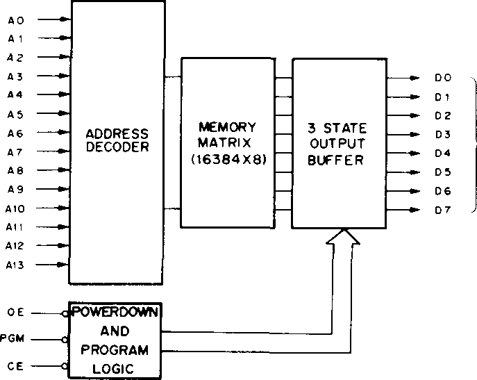{width="1.8125in"
height="1.4430555555555555in"}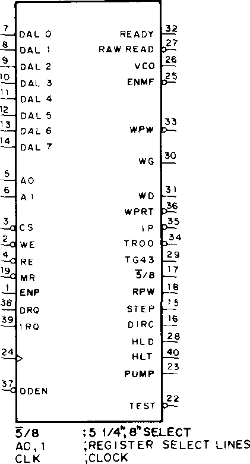{width="1.1111111111111112in"
height="2.058333333333333in"}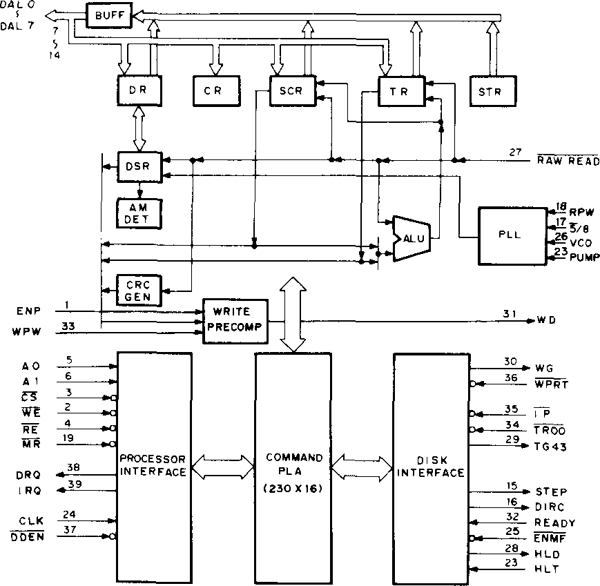{width="2.2930555555555556in"
height="2.2402777777777776in"}
