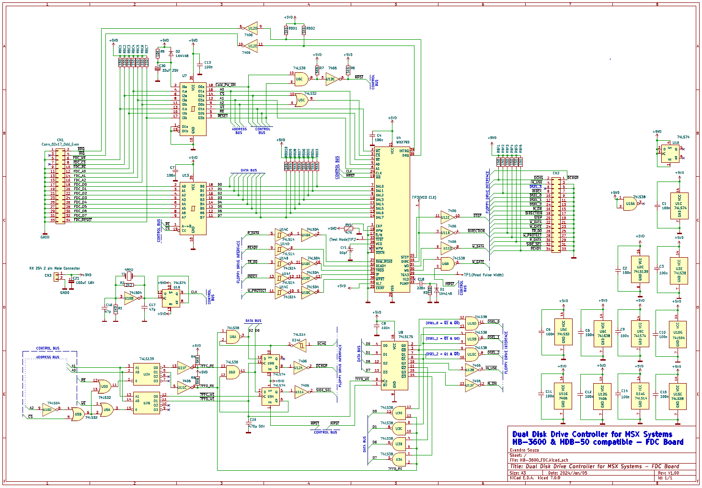

**MSX Dual Disk Drive Controller**

**HB720**

***Based on Memory Mapped Registers***

**Compatible with:**

**EPCOM/SHARP HB-3600**


**SONY HBD-50**


***Based on MSXHans, 2001 PDF***

***By Evandro Souza 2024, January.***

**TABLE**

**OF CONTENTS**

**1. OPERATION**

1-1. FEATURES 1-1

[1-2. SPECIFICATIONS 1-1](#bookmark8)

[1-3. PARTS IDENTIFICATION 1-1](#bookmark4)

1.  

[-3-1. Drive Unit 1-1](#bookmark6)1-3-2. Interface Cartridge 1-1

1-4. CONNECTING THE UNIT 1-2

[1-5. INSERTING A DISK 1-2](#bookmark12)

[1-6. STARTING UP MSX-DISK BASIC 1-2](#bookmark10)

[1-7. FORMATTING A BLANK DISK 1-3](#bookmark14)

[1-8. PIN ASSIGNMENT OF THE CONNECTORS ..1-3](#bookmark16)

**2. THEORY OF OPERATION**

2-1. HB720 CARTRIDGE

2-1-1. Memory Map ...

2-1-2. Selection by Cartridge ...

2-1-3. Selection by FDC Controller .

2-2. FDC

2-2-1. Memory Map Detailed

2-2-2. Selection of Individual FDC Registers

2-2-3. Operation of Individual Registers 

2-1
2-2

**3. BLOCK DIAGRAM**

OVERALL BLOCK DIAGRAM

**4. SCHEMATIC DIAGRAM AND PRINTED CIRCUIT BOARD**

CARTRIDGE BOARD PCB 3D VIEW

CARTRIDGE BOARD Schematics

FDC BOARD PCB 3D VIEW

FDC BOARD SCHEMATICS


1.  **OPERATION**

>
> **1-3. PARTS IDENTIFICATION**

The HBD-50 floppydisk drive unit allows 3 1/2-inch micro floppydisks to
be used with an MSX standard computer.

The 3 1/2-inch micro floppydisk is packaged in a hard case provided with
a metal disk guard. 360K bytes of data can be recorded on a single disk
and the contents can be easily retrieved and rewritten. This floppydisk
drive unit will greatly extend the information-handling capabilities of
your MSX computer.


**1-3-1. Drive Unit**

**1-2. SPECIFICATIONS**

**Interface Section**

Interface specifications

Internal ROM

Power consumption

Fits to MSX slots

16K bytes

Standard I/O routines

Standard DOS routines

MSX-Disk BASIC Utility routines

+ 5 V, 300 mA or less

**Drive Section**

Disk used

Disk type

Recording capacity

5¼" and 3 1/2" floppy disk

Single and Double-sided

Formatted : 360K / 720K bytes

Bytes/sector: 512

Sectors/track : 9

Tracks/cylinder: 2

Tracks/disk: 80

Bytes/disk : 360K / 720K

40 / 80 cylinders

40 / 80 / 160 tracks

MFM (Modified-Frequency Modulation)

300 rpm

250 K bits/sec

100 msec

Average : 350 msec

Between tracks : 12 msec

Settling time : 30 msec

WD2793-02

Total no. of cylinders Total no. of tracks Recording method Disk
rotation speed Data transfer rate Average latency time Access time

Controller

United kingdom model 240V ac, 50Hz

European model 220 V ac, 50 Hz

Brazilian model 127/220V ac (switch selected) 60 Hz

United Kingdom model 25W

European model 24 W

Brazilian model 16W

10°C-35°C (50°F-95°F) 160 x 67 x 260 mm (w/h/d)

For the drive unit only, including the projecting parts

Interface cartridge : 240 g

Drive unit: 2.7 kg (excludes the disk)

Blank disk (1)

Disk labels (3)

** PIN ASSIGNMENT OF THE CONNECTORS**
>
> **Pin Assignment of the Connectors**
>
> HB720 CARTRIDGE TO FDC: IDC 34 pins connector (BOTH SIDES)
>

  ```
  ---------------------------------------------------------------------------------
  Pin   Signal       Pin   Signal         Pin   Signal       Pin No. Signal
  No.                No.                  No.                        
  ----- ------------ ----- -------------- ----- ------------ ------- --------------
  1     GNDD         10    FDC_RE         19    GNDD         28      FDC_D5
        (RETURN)                                (RETURN)             

  2     DRQ          11    GNDD (RETURN)  20    FDC_D1       29      GNDD (RETURN)

  3     N.C.         12    FDC_A0         21    GNDD         30      FDC_D6
                                                (RETURN)             

  4     IRQ          13    GNDD (RETURN)  22    FDC_D2       31      GNDD (RETURN)

  5     GNDD         14    FDC_A1         23    GNDD         32      FDC_D7
        (RETURN)                                (RETURN)             

  6     FDC_WE       15    GNDD (RETURN)  24    FDC_D3       33      GNDD (RETURN)

  7     N.C.         16    FDC_A2         25    GNDD         34      RESET
                                                (RETURN)             

  8     FDC_CS       17    GNDD (RETURN)  26    FDC_D4       None    NONE

  9     GNDD         18    FDC_D0         27    GNDD          None   NONE
        (RETURN)                                (RETURN)             
  ---------------------------------------------------------------------------------
  ```

> HB720 FDC TO EXT FLOPPPY DRIVE -- Edge card connector (34 pins)

-   The pinout are the same for 5 ¼" and 3 ½" drives and the cable may
    have both options:

    -   To use with 5 ¼", the connector is a card edge;

    -   To use with 3 ½" the connector is a 34 pin female IDC.
```
  ---------------------------------------------------------------------------------
  Pin   Signal         Pin   Signal       Pin   Signal      Pin    Signal
  No.                  No.                No.               No.    
  ----- -------------- ----- ------------ ----- ----------- ------ ----------------
  1     DISK CHANGE    10    DRIVE SELECT 19    GNDD        28     WRITE PROTECT
        RESET                0                  (RETURN)           

  2     DISK CHANGE    11    GNDD         20    STEP        29     GNDD (RETURN)
                             (RETURN)                              

  3     GNDD (RETURN)  12    DRIVE SELECT 21    GNDD        30     READ DATA
                             1                  (RETURN)           

  4     IN USE         13    GNDD         22    WRITE DATA  31     GNDD (RETURN)
                             (RETURN)                              

  5     GNDD (RETURN)  14    DRIVE SELECT 23    GNDD        32     (HEAD SELECT)
                             2                  (RETURN)           

  6     DRIVE SELECT 3 15    GNDD         24    WRITE GATE  33     GNDD (RETURN)
                             (RETURN)                              

  7     GNDD (RETURN)  16    MOTOR ON     25    GNDD        34     READY
                                                (RETURN)           

  8     INDEX          17    GNDD         26    TRACK 00    None   NONE
                             (RETURN)                              

  9     GNDD (RETURN)  18    DIRECTION    27    GNDD        None   NONE
                                                (RETURN)           
  ---------------------------------------------------------------------------------
```

## **THEORY OF OPERATION**

**2-1. Cartridge Board**

**2-1-1. Memory Map**

This board cartridge uses the MSX computer cartridge slot. Addresses
4000H through 7FFFH on the memory map have been allocated to the HB720
cartridge.


**2-1-2. Selection by HB720 Cartridge**

> When the HB720 cartridge has been inserted into the MSX computer
> cartridge slot, addresses 4000H through 7FFFH will be selected by the
> cartridge connector signal CS1. In addition, U1 will AND signal SLTSL
> and the ICS (address decoder) output that has been inverted by U1, and
> will provide an output to U5 (ROM) pin CE for selection of the ROM.

**2-1-3. Selection by FDC Controller**

Individual registers of the FDC board have been allocated to the memory
space for addresses 7FF8H through 7FFFH, and are selected by address
signals A0 through A2 and signal FDC_CS.


**2-2. FDC Board**

**2-2-1. Memory Map Detailed**

**2-2-2. Selection of Individual FDC chip Registers**

Individual registers of the FDC (U4) have been allocated to addresses
7FF8H through 7FFBH, and are selected by address signals AO through A2
and signal CS.

> 
>
> CR (COMMAND REGISTER
>
> DR (DATA REGISTER
>
> DSR (DATA SHIFT REGISTER
>
> SCR (SECTOR REGISTER
>
> TR (TRACK REGISTER
>
> STR (STATUS REGISTER


> Hl-Z (HIGH IMPEDANCE)

**2-2-3. Operation of Individual Registers**

-   IRQ/DRQ Status - 7FFFH


> IRQ will be made \"0\" when the completion of a command has been
> either concluded or terminated during process.
>
> DRQ will be made \"0\" when the data write/read are being requested.

-   Drive Select - 7FFDH

> 

-   Side Select - 7FFCH

DATA BIT

> {width="2.7291852580927385in"
> height="0.39641732283464565in"}

At \"0\", side 0 will be selected, and at \"1\", side 1 will be selected

-   Command Register (CR) - 7FF8H

This is an 8-bit write register, where the commands that correspond to
the WD2793-02 operation will be written from the processor.

With the exception of a forced interrupt command, the command writing
operation takes place after completion of the previous WD2793-02
command.

-   Status Register (STR) - 7FF8H

This is an 8-bit read register. This register indicates the WD2793-02
internal status, the command execution processed status, and the disk
drive status. The significance of individual bits will vary depending on
whether the command is being executed or the command execution has
already been concluded.

-   Data Register (DR) - 7FFBH

This is a read/write register. In a disk reading mode, the data read of
the disk will be loaded into this register. In a disk writing mode, the
data that has been written earlier into this register will be written
into the disk. In a seek mode, the target track address will be written
this register.

-   Track Register (TR) - 7FF9H

This is an 8-bit read/write register. The low-high transition of MR
(master reset) will set TR at FFH. When TROO becomes low, TR will be
made OOH.

The track number at which the head is located will usually be set in
this register. At WD2793-02, this value may either be updated or not,
depending on the command. In the case of a read data command or a write
data command, the contents of this register will be compared with an ID
field track number read of the disk, and when they coincide with each
other, the read or write operation will duly be carried out.

-   Sector Register (SCR) - 7FFAH

This is an 8-bit read/write register. In the case of a read data command
or a write data command, the contents of this register will be compared
with an ID field track number read of the disk, and when they coincide
with each other, the read or write operation will duly be carried out.

When under a read address command, the ID field track number will be
retained intact.

## **OVERALL BLOCK DIAGRAM**


## **HB720 Boards**

**SCHEMATIC DIAGRAM AND PRINTED CIRCUIT BOARD**

**CARTRIDGE BOARD - 3D VIEW**


## CARTRIDGE BOARD -- SCHEMATICS


**FDC Board - 3D VIEW**


## FDC Board Schematics


