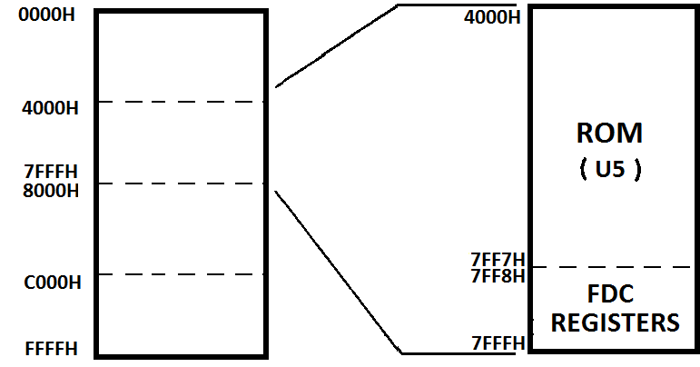
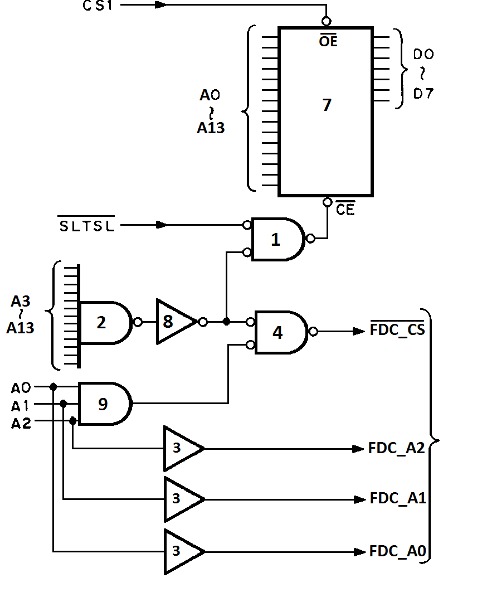
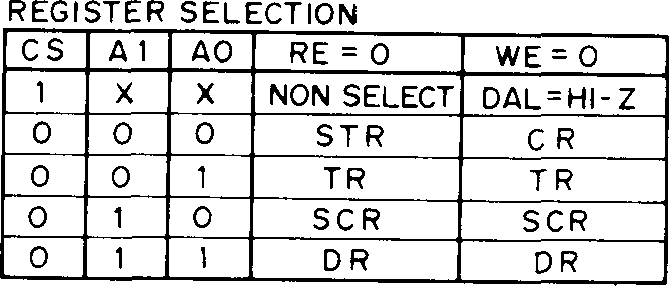
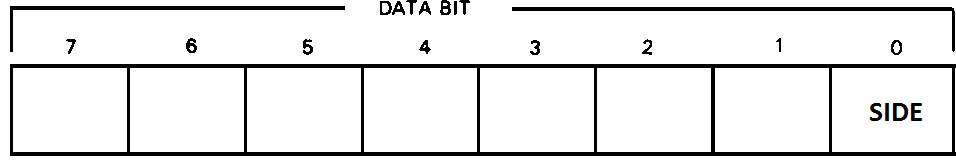
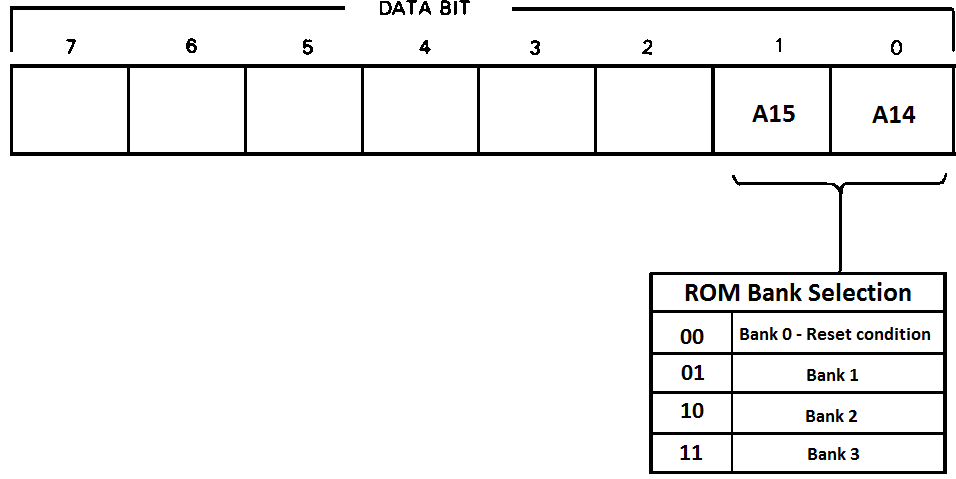
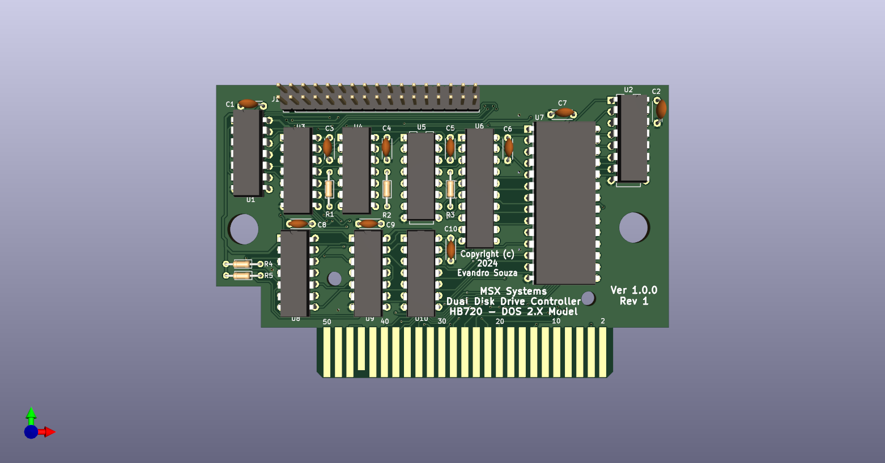
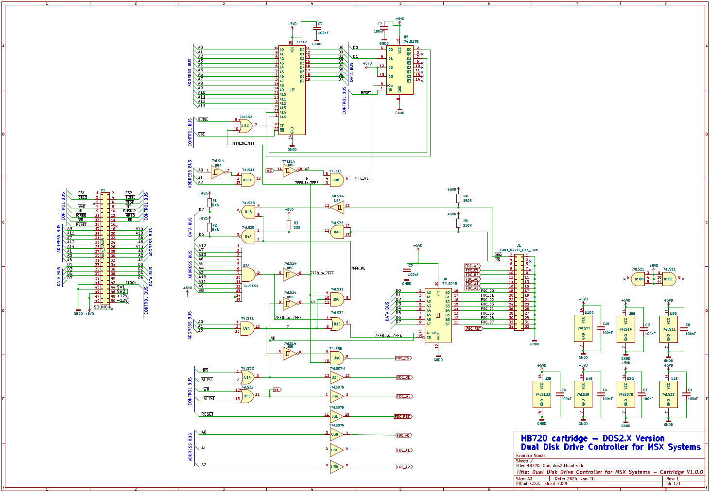

<div align="center">

**MSX Dual Disk Drive Controller**

**HB720**

***Based on Memory Mapped I/O Registers***

***Compatible with MSX1 class computers AND MSX2/MSX-DOS2.X***

</div>

**EPCOM/SHARP HB-3600**


**SONY HBD-50**


***Based on MSXHans, 2001 PDF***

***By Evandro Souza 2024, January.***
  
---

## **THEORY OF OPERATION**

## **2-1. Cartridge Board**

## **2-1-1. MSX-DOS 1.X Version => Compatible with all MSX machines**


**2-1-1-1. Memory Map**

This board cartridge uses the MSX computer cartridge slot. 16K ROM addresses 4000H through 7FFFH on the memory map have been allocated to the HB720 cartridge.



**2-1-1-2. Selection by HB720 Cartridge**

When the HB720 cartridge has been inserted into the MSX computer cartridge slot, 4000H-7FFFH address space will be selected by the cartridge connector signal CS1. In addition, U1 will AND signal SLTSL and the U2 (address decoder) output that has been inverted by U8, and will provide an output to U7 (ROM) pin CE for selection. All this signals are valid as 0, so the used logic port is an OR.

**2-1-1-3. Selection by FDC Controller**

Individual registers of the FDC board have been allocated to the memory space for addresses 7FF8H-7FFFH, and are selected by address signals A0 through A2 and signal FDC_CS.


**2-1-1-4. Memory Map of Control Ports in detail**


---

## **2-1-2. MSX-DOS 2.X Version => Compatible with MSX 2.0 and up with Memory Mapper**


**2-1-2-1. Memory Map**

This board cartridge uses the MSX computer cartridge slot. The 64KB ROM is mapped into banks onto Z80 address space 4000H-7FFFH through U5 (ROM bank selector hardware that sends the A14 and A15 - the high order - bits to U7 ROM) will be selected by the cartridge connector signal CS1. In addition, U1 will AND signal SLTSL and the U6 (address decoder) output that has been inverted by U8, and will provide an output to U7 (ROM) pin CE for selection of the ROM. All this signals are valid as 0 (low), so the used logic port is an OR.


**2-1-2-2. Selection by HB720 Cartridge**

When the HB720 cartridge has been inserted into the MSX computer cartridge slot, addresses 4000H through 7FFFH will be selected by the cartridge connector signal CS1. U1 will AND signal SLTSL and the U6 (address decoder) output that has been inverted by U8, and will provide an output to U7 (ROM) pin CE for selection of the ROM.

**2-1-2-3. Selection by FDC Controller**

Individual registers of the FDC board have been allocated to the memory space for addresses 7FF8H through 7FFFH, and are selected by address signals A0 through A2 and signal FDC_CS.



**2-1-2-4. Memory Map of Control Ports in detail**


## **2-2. FDC BOARD - THE COMMON PART**

**2-2-1. Selection of Individual FDC chip Registers**

Individual registers of the FDC (U4) have been allocated to addresses 7FF8H through 7FFBH, and are selected by address signals AO through A2 and signal CS.


CR (COMMAND REGISTER

DR (DATA REGISTER

DSR (DATA SHIFT REGISTER

SCR (SECTOR REGISTER

TR (TRACK REGISTER

STR (STATUS REGISTER



    0    (LOW LEVEL)

    1    (HIGH LEVEL)

    HI-Z (HIGH IMPEDANCE)
 
 

**2-2-2. Operation of Individual Registers**

-   Command Register (CR) - 7FF8H

This is an 8-bit write register, where the commands that correspond to the WD2793-02 operation will be written from the processor.

With the exception of a forced interrupt command, the command writing operation takes place after completion of the previous WD2793-02 command.

-   Status Register (STR) - 7FF8H

This is an 8-bit read register. This register indicates the WD2793-02 internal status, the command execution processed status, and the disk drive status. The significance of individual bits will vary depending on whether the command is being executed or the command execution has already been concluded.

-   Track Register (TR) - 7FF9H

This is an 8-bit read/write register. The low-high transition of MR (master reset) will set TR at FFH. When TR00 becomes low, TR will be made 00H.

The track number at which the head is located will usually be set in this register. At WD2793-02, this value may either be updated or not, depending on the command. In the case of a read data command or a write data command, the contents of this register will be compared with an ID field track number read of the disk, and when they coincide with each other, the read or write operation will duly be carried out.

-   Sector Register (SCR) - 7FFAH

This is an 8-bit read/write register. In the case of a read data command or a write data command, the contents of this register will be compared with an ID field track number read of the disk, and when they coincide with each other, the read or write operation will duly be carried out.

When under a read address command, the ID field track number will be retained intact.

-   Data Register (DR) - 7FFBH

This is a read/write register. In a disk reading mode, the data read of the disk will be loaded into this register. In a disk writing mode, the data that has been written earlier into this register will be written into the disk. In a seek mode, the target track address will be written this register.

-   Side Select - 7FFCH



At \"0\", side 0 will be selected, and at \"1\", side 1 will be selected

-   Drive Select - 7FFDH


-   ASCII16 - DOS2 ROM Bank Selector - 7FFEH (Only DOS 2.X Model)




-   IRQ/DRQ Status - 7FFFH


IRQ will be made \"0\" when the completion of a command has been > either concluded or terminated during process.
DRQ will be made \"0\" when the data write/read are being requested.

---

## **HB720 Boards**

**SCHEMATIC DIAGRAM AND PRINTED CIRCUIT BOARD**

I shared here a full set of Gerber files of the three boards, to allow direct order the PCB's to manufacturers. They are all inside gerber directory.


**CARTRIDGE BOARD DOS1.X VERSION:**


**CARTRIDGE BOARD DOS2.X VERSION:**






**FDC Board - THE COMMON PART:**


---
** PIN ASSIGNMENT OF THE CONNECTORS**
>
> **Pin Assignment of the Connectors**
>
> HB720 CARTRIDGE TO FDC: IDC 34 pins connector (BOTH SIDES)
>

  ```
  ---------------------------------------------------------------------------------
  Pin   Signal       Pin   Signal         Pin   Signal       Pin No. Signal
  No.                No.                  No.                        
  ----- ------------ ----- -------------- ----- ------------ ------- --------------
  1     GNDD         10    FDC_RE         19    GNDD         28      FDC_D5
        (RETURN)                                (RETURN)             

  2     DRQ          11    GNDD (RETURN)  20    FDC_D1       29      GNDD (RETURN)

  3     N.C.         12    FDC_A0         21    GNDD         30      FDC_D6
                                                (RETURN)             

  4     IRQ          13    GNDD (RETURN)  22    FDC_D2       31      GNDD (RETURN)

  5     GNDD         14    FDC_A1         23    GNDD         32      FDC_D7
        (RETURN)                                (RETURN)             

  6     FDC_WE       15    GNDD (RETURN)  24    FDC_D3       33      GNDD (RETURN)

  7     N.C.         16    FDC_A2         25    GNDD         34      RESET
                                                (RETURN)             

  8     FDC_CS       17    GNDD (RETURN)  26    FDC_D4       None    NONE

  9     GNDD         18    FDC_D0         27    GNDD          None   NONE
        (RETURN)                                (RETURN)             
  ---------------------------------------------------------------------------------
  ```

> HB720 FDC TO EXT FLOPPPY DRIVE -- Edge card connector (34 pins)

-   The pinout are the same for 5 ¼" and 3 ½" drives and the cable may
    have both options:

    -   To use with 5 ¼", the connector is a card edge;

    -   To use with 3 ½" the connector is a 34 pin female IDC.
```
  ---------------------------------------------------------------------------------
  Pin   Signal         Pin   Signal       Pin   Signal      Pin    Signal
  No.                  No.                No.               No.    
  ----- -------------- ----- ------------ ----- ----------- ------ ----------------
  1     DISK CHANGE    10    DRIVE SELECT 19    GNDD        28     WRITE PROTECT
        RESET                0                  (RETURN)           

  2     DISK CHANGE    11    GNDD         20    STEP        29     GNDD (RETURN)
                             (RETURN)                              

  3     GNDD (RETURN)  12    DRIVE SELECT 21    GNDD        30     READ DATA
                             1                  (RETURN)           

  4     IN USE         13    GNDD         22    WRITE DATA  31     GNDD (RETURN)
                             (RETURN)                              

  5     GNDD (RETURN)  14    DRIVE SELECT 23    GNDD        32     (HEAD SELECT)
                             2                  (RETURN)           

  6     DRIVE SELECT 3 15    GNDD         24    WRITE GATE  33     GNDD (RETURN)
                             (RETURN)                              

  7     GNDD (RETURN)  16    MOTOR ON     25    GNDD        34     READY
                                                (RETURN)           

  8     INDEX          17    GNDD         26    TRACK 00    None   NONE
                             (RETURN)                              

  9     GNDD (RETURN)  18    DIRECTION    27    GNDD        None   NONE
                                                (RETURN)           
  ---------------------------------------------------------------------------------
  
